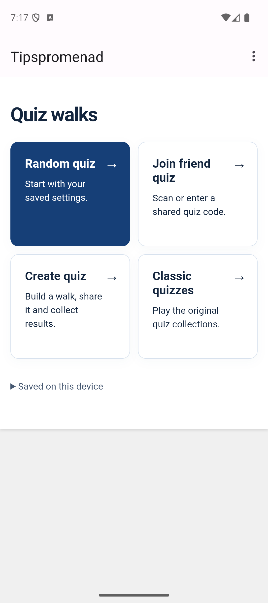
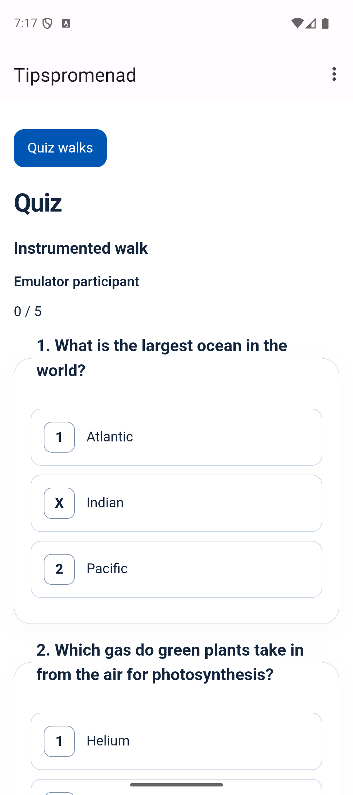
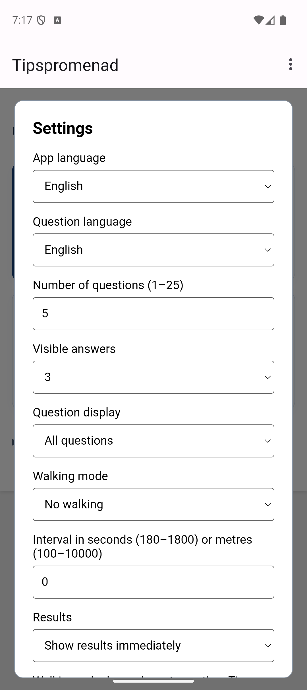
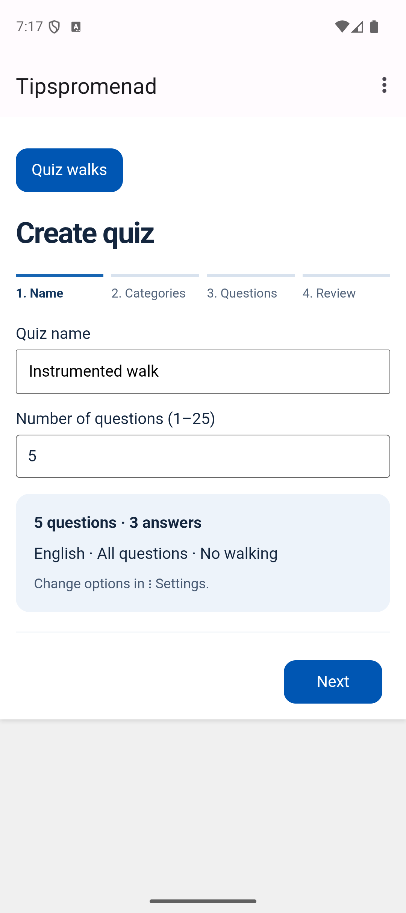
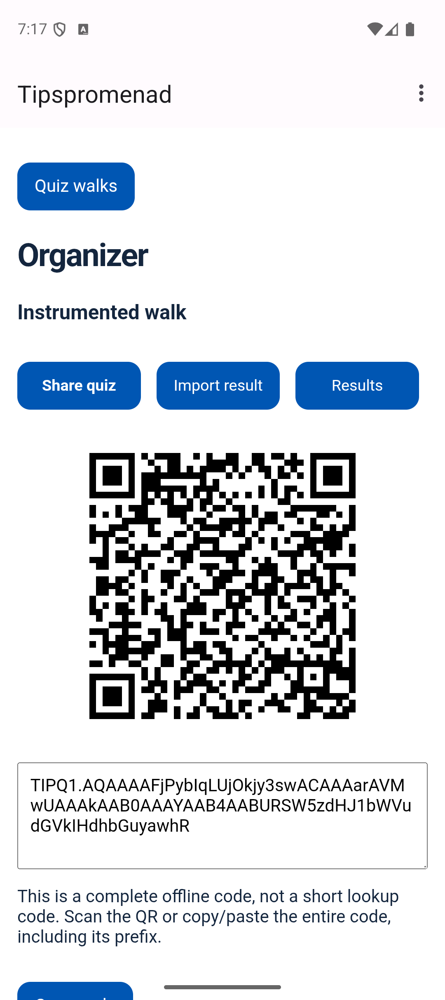
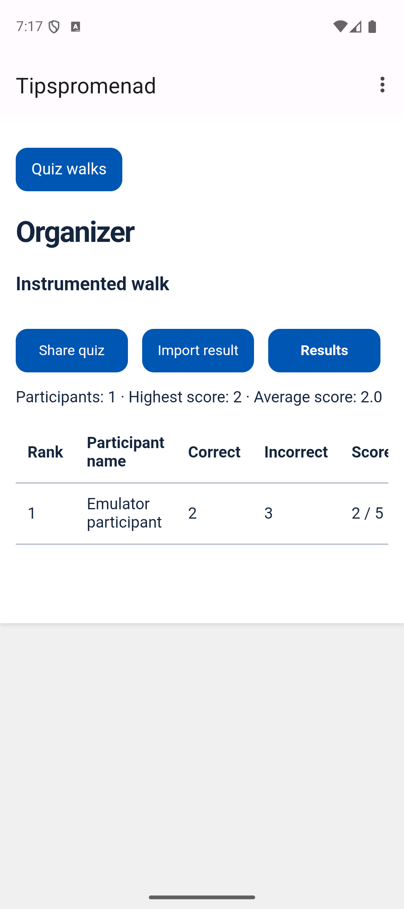

# Tipspromenad for Android

Create, share and play the traditional Swedish quiz walk offline. The Android app is the organizer and participant client; the website also supports creation and participation. No participant backend is required.

## Features

- Random and manually selected quizzes using categories/subcategories, 1–25 questions and 2/3/4 visible answers.
- 17 selectable languages with English fallback where translations are unavailable. Independent question language.
- Portable quiz QR/full text code; named participants; portable result QR/code; local result collection, scores and ranking.
- All questions or one at a time, persistent timed walking and foreground GPS distance walking.
- Settings in the top-right menu, About and Quit. Existing Classic Quizzes remain available.
- Bundled question bank and engine start offline. Participant records stay on-device; cloud/device-transfer backups are excluded.

Experimental short-code sharing is hosted directly by the Android phone on the same local network.

## Three repositories

| Repository | Role |
| --- | --- |
| [Android](https://github.com/Nilsson82/Tipspromenad-app-for-Android) | Bundled offline app, organizer and participant |
| [QuizWebPage](https://github.com/Nilsson82/TipspromenadQuizWebPage) | Shared JS runtime and static participant website |
| [Tipspromenad](https://github.com/Nilsson82/Tipspromenad) | Versioned question data and ID registry, no application logic |

Local companion checkouts live in `related-projects/` and have independent Git histories. The former webpack app was preserved in `legacy-projects/Tipspromenad-web/` before converting Tipspromenad into a data-only project. These folders and delivery ZIPs are ignored by the Android repository.

## Build and test

JDK 21, Android SDK 36, Gradle wrapper 8.13, AGP 8.13.2 and Kotlin 2.0.21. Android minSdk 32. Use the wrapper; no Java 25 requirement.

```powershell
$env:JAVA_HOME = 'C:\\Users\\ander\\.jdks\\jbr-21.0.11'
$env:GRADLE_USER_HOME = 'C:\\Users\\ander\\.gradle'
.\\gradlew.bat assembleDebug testDebugUnitTest lintDebug --console=plain
# With an emulator connected:
.\\gradlew.bat connectedDebugAndroidTest --console=plain
```

APK: `app/build/outputs/apk/debug/app-debug.apk`. Install on Android 12 or newer. This is a debug build, not a signed production release. App data from the former remote WebView origin is not migrated to the new bundled origin.

Bundled assets are checked in so Android builds independently. After editing the companion runtime or bank, run `powershell -File tools/sync-offline-assets.ps1` from this workspace; `-Check` verifies identical files. The old sync-web-assets entry point forwards to this command.

Web/data tests (Node 22+):

```powershell
node --test related-projects/TipspromenadQuizWebPage/tests/*.test.cjs related-projects/Tipspromenad/tests/*.test.cjs
```

Package companion repositories: `powershell -File tools/package-web-projects.ps1 -Label portable-walks`. Each ZIP contains that repository's files without Git internals or installed dependencies. The question repository has no webpack build now.

## Screenshots

Actual Pixel 9 / Android 15 emulator captures from the workflow test. Sample quiz/participant names are test data, not production users.

| Main menu | Quiz | Settings |
| --- | --- | --- |
|  |  |  |

| Create quiz | Share quiz | Results |
| --- | --- | --- |
|  |  |  |

## Documentation and privacy

[Portable format, architecture, limits and verification](docs/PORTABLE-WALKS.md) · [Privacy information](PRIVACY_POLICY.md) · [Source publication notice](LICENSE) · [Commit messages for all three projects](docs/COMMIT-MESSAGES.md).

Camera starts only for scanning. Location is requested only for distance walking; keep the app visible. Background travel is not counted. No route is stored or uploaded. Clearing app data removes saved quizzes/results. Classic external images and optional revision downloads may need internet.

Physical QR/permission and outdoor GPS checks, cross-browser offline checks, editorial review, definitive question-data licensing, production signing and store metadata remain release work. No GitHub push, deployment or store release was performed.

## Current shared quiz features

Android and WebQuiz support quiz creation, manual/random category selection, difficulty filters, four answer alternatives, participant names and portable quiz/result codes. Numerical tie-breakers appear after normal questions and rank equal scores by absolute difference; they do not increase the normal score.

Progress gates are optional. Android requires both elapsed time and distance when both are enabled. Next stays disabled until the gate is satisfied and an answer is selected; readiness does not automatically advance. Attempts and gate progress persist locally. GPS measures foreground movement. WebQuiz ignores distance requirements and retains time requirements, with a visible explanation.

Experimental local sharing uses the **Android phone as the host**. Start hosting from Experimental Wi-Fi sharing, choose a saved quiz, and share the displayed local address and short room code. Participants open that address on the same Wi-Fi/hotspot. The phone serves the quiz database and collects results locally; no computer or cloud participant service is required. Keep the host service running (visible notification). Results that cannot be sent are saved locally and retried while the participant page is open. Network isolation on some Wi-Fi networks can prevent connections. Automatic discovery is not implemented. Physical phone-to-phone Wi-Fi and outdoor GPS still need real-device testing.

There are 17 selectable language codes: en, sv, es, da, no, fi, is, th, zh, ja, ko, de, fr, it, nl, pt, pl. Translation coverage varies: core navigation, six starter questions and two tie-breakers cover all 17; other missing text falls back to English. Classic quizzes retain the original six languages and use English for newly added languages.

Revision 2 contains 78 normal questions and two numerical tie-breakers, including 48 new normal questions. Existing questions remain, including previously deprecated entries. Published revisions must remain immutable. Online clients check the question repository's latest manifest and verified SHA-256; bundled/cached data supports offline use. Portable codes identify the exact revision and question IDs. LAN joining also transfers that revision's bank, so it works without Internet access.

Participant names and answers are stored locally. Experimental LAN sharing explicitly sends them to the organizer's phone on the local network. Public question data and reference answers are not a secure examination/anti-cheating system.
